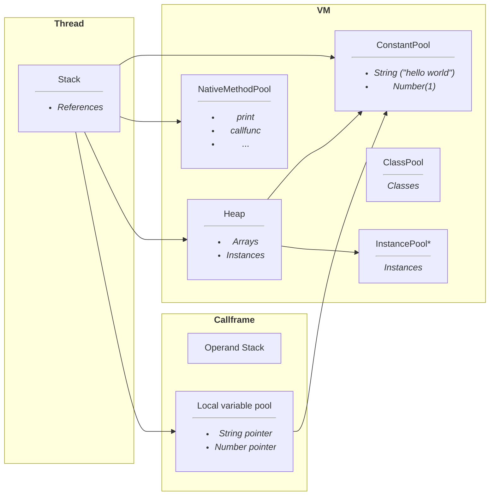
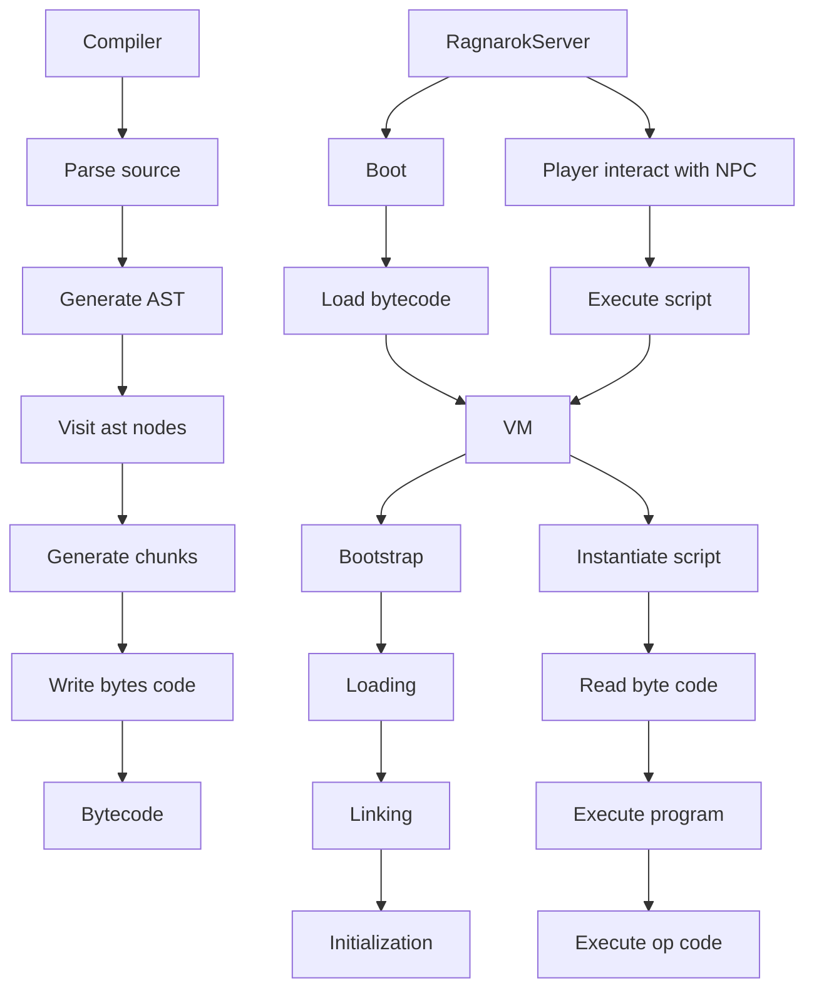

**WIP** [Check remaining todos](https://github.com/nmeylan/rathena-script-lang-interpreter/issues/1) or [code samples](https://github.com/nmeylan/rathena-script-lang-interpreter/tree/master/tests)

# rAthena script language interpreter
A grammar, parser, compiler and VM implementation for rAthena script language.

Inspired by [https://github.com/Doddler/Scripting-Language-Guide](https://github.com/Doddler/Scripting-Language-Guide) and [https://craftinginterpreters.com/](https://craftinginterpreters.com/).

VM architecture inspired by [jvm](https://docs.oracle.com/javase/specs/jvms/se11/html/index.html)

This crate offers a compiler and VM to be embedded in game server.

# Generate Parser
`java -jar bin/antlr4.9.4-rust.jar RathenaScriptLang.g4 -Dlanguage=Rust -visitor -o src/parser`

# Grammar
Grammar is defined in `RathenaScriptLang.g4` file. Parser is generated using `antlr`.

# Integration with a server
Currently only integretation for a rust server implementation is targeted. A C/C++ API can be provided to integrate it in [herculesWS](https://github.com/HerculesWS/Hercules) and [rathena](https://github.com/rathena/rathena)

Vm should be run inside mmo server. NPC script can be pre-compiled or compiled at VM startup, using this crate.

Rathena script command related to game, almost all commands listed [here](https://github.com/rathena/rathena/blob/master/doc/script_commands.txt#L1012), have to be implemented in server side. 

Compiler considers those command as "native" functions. VM require to implement a native functions handler, which has to be implemented by the server.

# Features
In addition of providing a compiler and vm to interpret rathena script lang, this implementation provides:
- Nice compilation errors for easier code writing
```
Variable ".@c" is declared as a Number but is assigned with a String.
test_script 12:4.
l12	    .@c = str();
	    ^^^
```
- Nice runtime errors for easier debugging
```
Can't call getarg(1) which is greater than number of arguments provided: 1. Maximum index is 0. Consider calling getarg with a default value: getarg(1, DEFAULT_VALUE)
test_script 5:15.
l5	        .@a$ = getarg(1) + " world";
	               ^^^^^^^^^

0: _main
	at /home/ragnarok/dev/npc/warps.txt(Warper:3)
1: my_func
	at /home/ragnarok/dev/npc/warps.txt(Warper:5)
```
- Compilation for faster server startup
- Compilation type checking for variable assignment
- Compilation argument count checking for native functions

# Architecture
## Language specificity
Althought Rathena script lang is not an oriented object programming language, it has notion of:
- Global script(or npc) state, which are alive while server is alive
- Global script(or npc) state, which are alive for the duration of the script execution

To ease the implementation of the VM we will call:
- Script/NPC -> Class
- Script/NPC instance -> Instance

## VM Memory layout

## VM lifecycle


## Garbage collection (design in progress)
All "data" pool store references to constant pool. Only constant pool store values.

TBD
