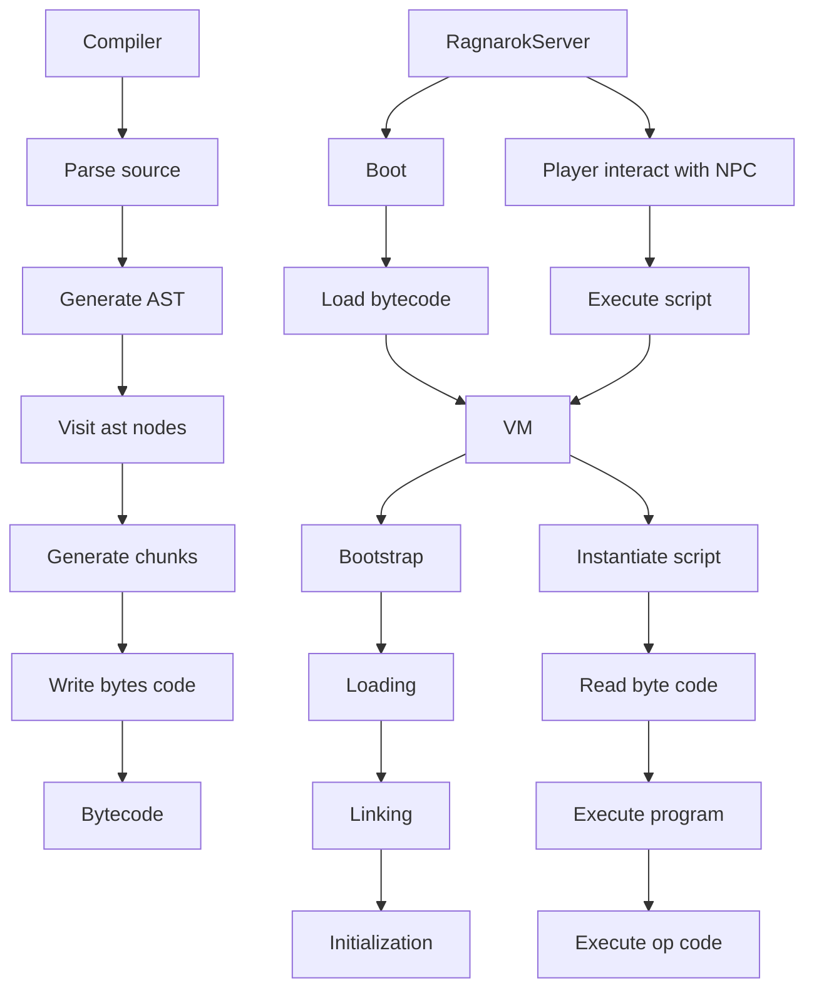

**WIP** [Check progress](https://github.com/nmeylan/rathena-script-lang-interpreter/issues/1)

# rAthena script language interpreter
A grammar, parser, compiler and VM implementation for rAthena script language.

Inspired by [https://github.com/Doddler/Scripting-Language-Guide](https://github.com/Doddler/Scripting-Language-Guide) and [https://craftinginterpreters.com/](https://craftinginterpreters.com/).

VM architecture inspired by [jvm](https://docs.oracle.com/javase/specs/jvms/se11/html/index.html)

This crate offers a compiler and VM to be embedded in game server.

# Generate Parser
`java -jar bin/antlr4.9.4-rust.jar RathenaScriptLang.g4 -Dlanguage=Rust -visitor -o src/parser`

# Grammar
Grammar is defined in `RathenaScriptLang.g4` file. Parser is generated using `antlr`.

# Integration with a server
Currently only integretation for a rust server implementation is targeted. A C/C++ API can be provided to integrate it in [herculesWS](https://github.com/HerculesWS/Hercules) and [rathena](https://github.com/rathena/rathena)

Vm should be run inside mmo server. NPC script can be pre-compiled or compiled at VM startup, using this crate.

Rathena script command related to game, almost all commands listed [here](https://github.com/rathena/rathena/blob/master/doc/script_commands.txt#L1012), have to be implemented in server side. 

Compiler considers those command as "native" functions. VM require to implement a native functions handler, which has to be implemented by the server.

# Architecture
## VM Memory layout

## VM lifecycle

