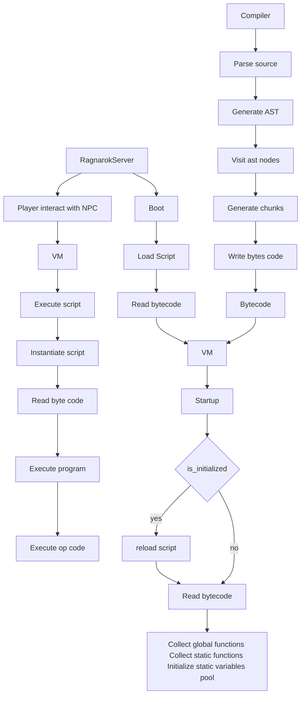

This project is work in progress, it will probably never be finished or never work.

# rAthena script language interpreter
A parser, compiler and VM implementation for rAthena script language.

Inspired by [https://github.com/Doddler/Scripting-Language-Guide](https://github.com/Doddler/Scripting-Language-Guide) and [https://craftinginterpreters.com/](https://craftinginterpreters.com/)

# Generate Parser
`java -jar bin/antlr4.9.4-rust.jar RathenaScriptLang.g4 -Dlanguage=Rust -visitor -o src/parser`

# Goal
My goal is to make [warper script](https://github.com/rathena/rathena/blob/master/npc/custom/warper.txt) working in my [custom emulator](https://github.com/nmeylan/rust-ro).

# Grammar
Grammar is defined in `RathenaScriptLang.g4` file. Parser is generated using `antlr`.

# Architecture
## VM Memory layout

## VM lifecycle

